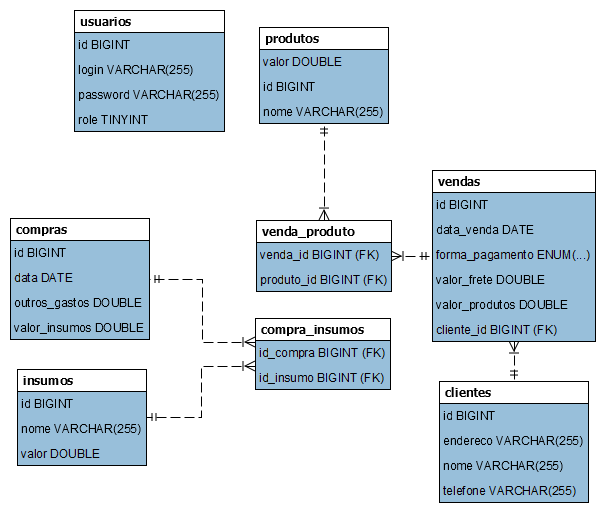
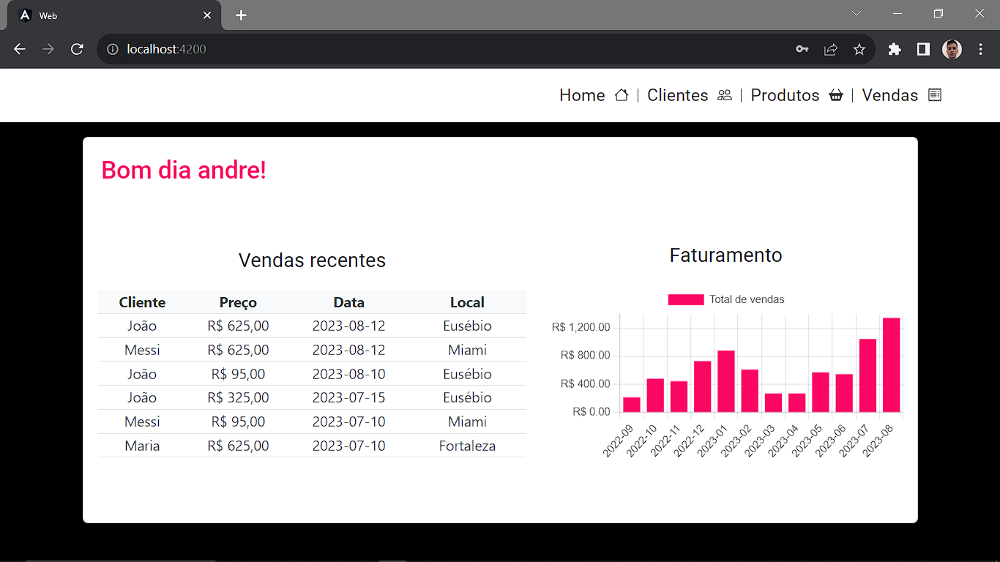

<h1 align="center">API Gerenciamento de loja</h3>

---

Aplicação desenvolvida para auxilixar nos registros sobre clientes, produtos e vendas de uma loja.
      

## 📝 Menu

- [Sobre](#sobre)
- [Importante](#importante)
- [Banco de dados](#bd)
- [Screenshots](#screenshots)
- [Tecnologias](#tecnologias)
- [Autor](#autor)

## 🧐 Sobre 

A aplicação possui crud de cliente, produto e venda. Na página inicial foram desenvolvidos dois relatórios a partir de duas queries personalizadas, um para exibir as vendas recentes e outro em formato de gráfico de barras que apresenta as receitas dos últimos 12 meses.

## ⚠️ Importante! 

☕ Desenvolvido com Java na versão 17. 
  

## 📊 Banco de Dados 
<h1 align="center">
  
</h1>

## 📸 Screenshots 
<h1 align="center">
    Efetuar login
    https://github.com/Andrejmrocha/sistema_vendas/assets/104024792/a2666754-2e66-4adb-b357-4053e57ab12a
</h1>

<h1 align="center">
    Home
    
</h1>

## ⛏️ Tecnologias 

- [Java 17](https://www.oracle.com/br/java/)
- [Spring boot](https://spring.io/projects/spring-boot)
- [Maven](https://maven.apache.org/)
- [Lombok](https://projectlombok.org/)
- [Mysql](https://www.mysql.com/)
- [Hibernate](https://hibernate.org/)
- [Auth0](https://auth0.com/)
- [Intellij](https://www.jetbrains.com/pt-br/idea/)

## ✍️ Autor 

- [@Andrejmrocha](https://github.com/Andrejmrocha) - Desenvolvimento back-end

